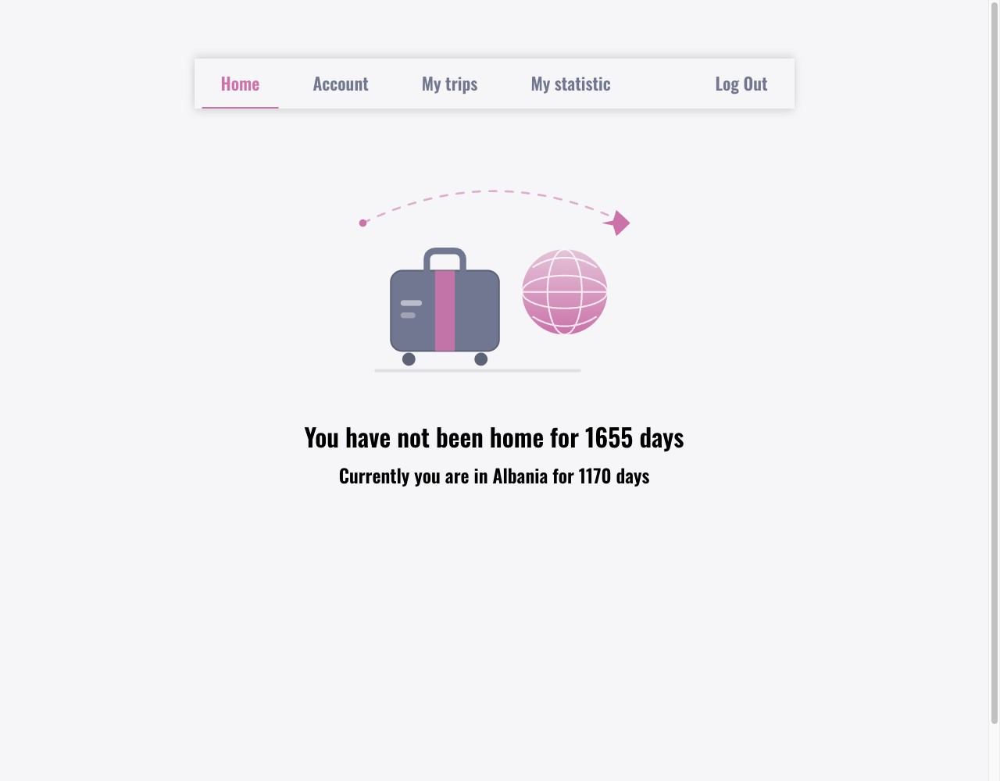
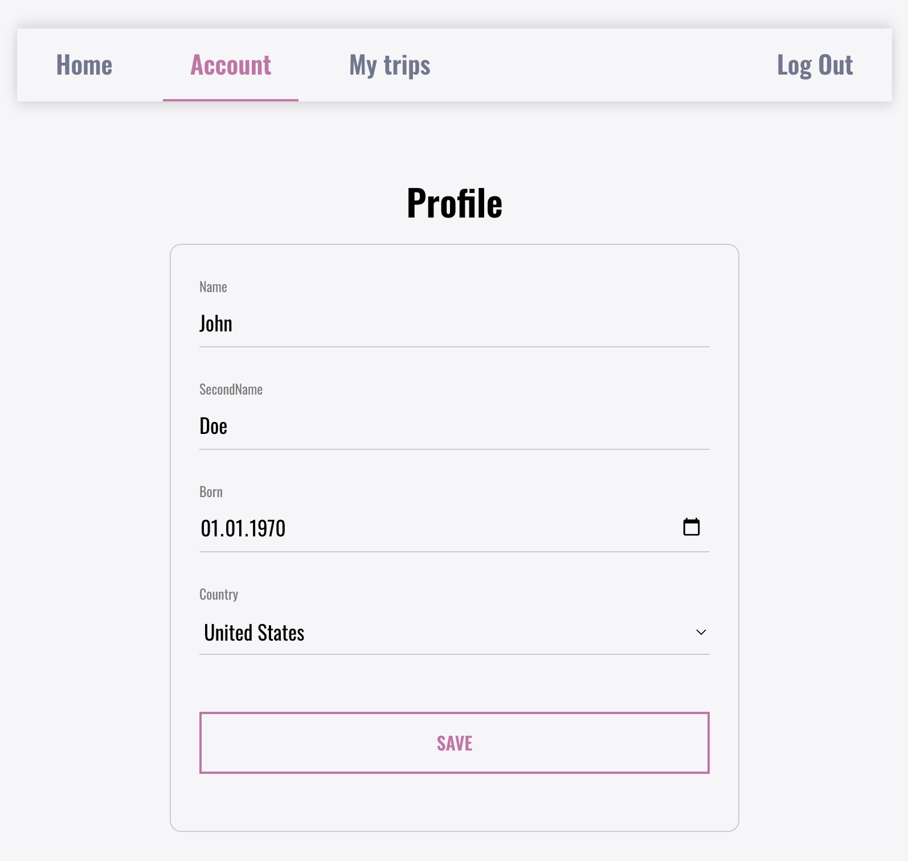
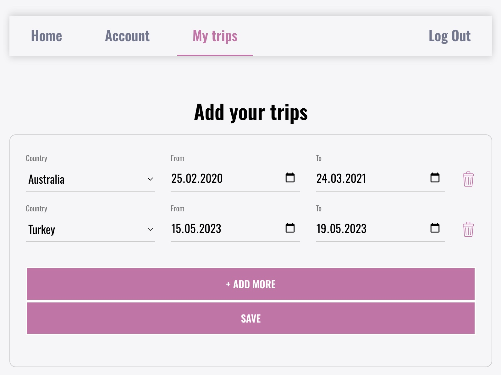
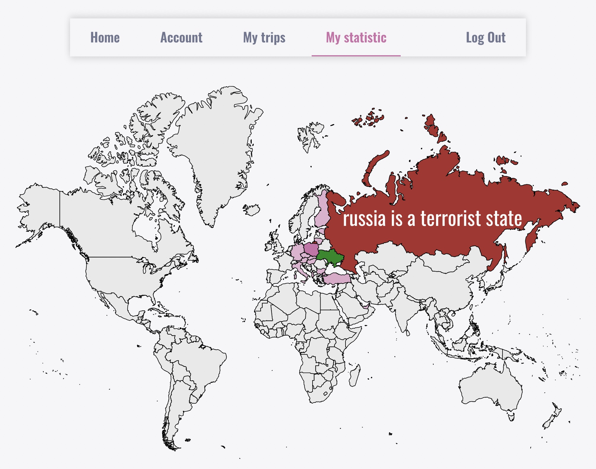

# Travel History Web App

This application allows users to track their travel history, displaying how many days they've spent abroad or at home. Users can add, view and edit details of their trips.

## Screenshots






## Features

- User Registration via Google, GitHub.
- A Main Screen displaying the number of days spent abroad or at home.
- History Screen for viewing and editing a list of visited countries, sortable by date or duration.
- Add New Country & Date Screen for recording new trips.
- Stay Statistics Screen for visual representation of time spent in various countries.

## Getting Started

These instructions will get you a copy of the project up and running on your local machine for development and testing purposes.

### Prerequisites

Node.js 22.22 or newer.

### Installing

```bash
npm install
```

### Configuration

The app reads its Firebase credentials from environment variables. Copy the
template and fill in the values from your Firebase project settings:

```bash
cp .env.example .env
```

| Variable | Description |
| --- | --- |
| `VITE_FIREBASE_API_KEY` | Web API key |
| `VITE_FIREBASE_AUTH_DOMAIN` | Auth domain, e.g. `your-project.firebaseapp.com` |
| `VITE_FIREBASE_PROJECT_ID` | Project ID |
| `VITE_FIREBASE_STORAGE_BUCKET` | Storage bucket |
| `VITE_FIREBASE_MESSAGING_SENDER_ID` | Messaging sender ID |
| `VITE_FIREBASE_APP_ID` | App ID |

### Run project

```bash
npm run dev
```

### Other commands

```bash
npm run build     # type-check and bundle for production
npm run lint      # eslint
npm run test:ci   # run tests once
npm run coverage  # tests with coverage
npm run format    # prettier
```

## Deployment

Pushing to `main` builds the app and publishes it to
[maksym-mytiuk.github.io](https://maksym-mytiuk.github.io/) via the `Deploy` workflow,
which pushes `dist/` to the `master` branch of the `Maksym-Mytiuk.github.io` repository.
It can also be triggered manually from the Actions tab.

The workflow needs these repository secrets: the six `VITE_FIREBASE_*` values used at
build time, plus `PAGES_DEPLOY_KEY` — the private half of a write-enabled deploy key on
the target repository.

For sign-in to work on the deployed site, the Pages domain must be listed under
Firebase Console → Authentication → Settings → Authorized domains.

## Build with

React 19, Vite, Redux Toolkit, React Router and Firebase.

## Authors

Maksym Mytiuk [github](https://github.com/Maksym-Mytiuk), [linkedin](https://www.linkedin.com/in/maksym-mytiuk/)
