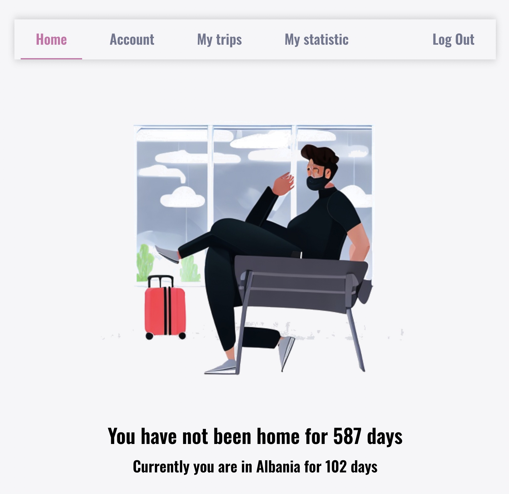

# Travel History Web App

This application allows users to track their travel history, displaying how many days they've spent abroad or at home. Users can add, view and edit details of their trips.

## Screenshots




## Features

- User Registration via Google, GitHub.
- A Main Screen displaying the number of days spent abroad or at home.
- History Screen for viewing and editing a list of visited countries, sortable by date or duration.
- Add New Country & Date Screen for recording new trips.
- ~~Stay Statistics Screen for visual representation of time spent in various countries.~~

## Getting Started

These instructions will get you a copy of the project up and running on your local machine for development and testing purposes.

### Prerequisites

What things you need to install the software and how to install them:

```bash
npm install npm@latest -g
```

### Installing

```bash
npm install
```

### Run project

```bash
npm run dev
```

## Build with

React.js

## Authors

Maksym Mytiuk [github](https://github.com/Maksym-Mytiuk), [linkedin](https://www.linkedin.com/in/maksym-mytiuk/)
